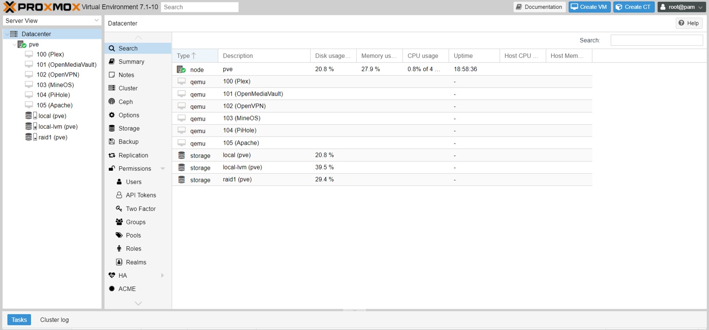
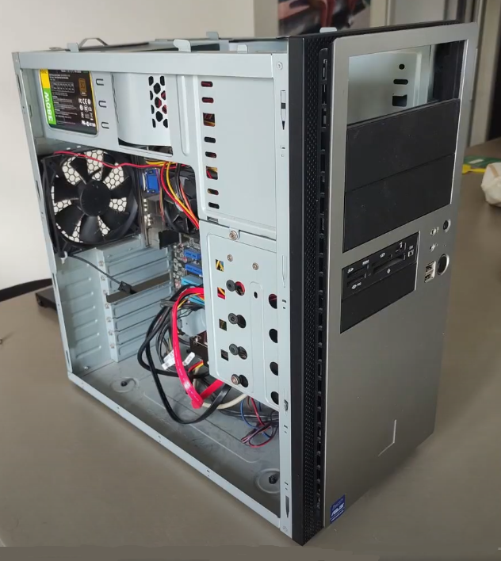

# Proxmox Server

Motivated by my desire to experiment with a home server, I embarked on this project to gain knowledge and experience in the field. Setting up a Proxmox server proved to be both educational and fascinating, enabling me to explore the various advantages of having a home server. Additionally, this endeavor deepened my understanding of virtualization and hypervisors.

**Video:** [YouTube](https://www.youtube.com/watch?v=K5Pa26CCZfE)

**Completed:** May 2022

## Proxmox Home Server

The hardware for my server consisted of an older computer with modest specifications - 4GB of RAM and an aging AMD Phenom processor. Unfortunately, due to the performance limitations of this setup, the server is no longer in use today.

I began by thoroughly cleaning the computer and installing Proxmox as the server's operating system. The server featured two 1TB hard drives configured in a RAID 1 setup, ensuring data redundancy and enhancing overall system reliability.

Next, I proceeded to set up a virtual machine (VM) running Plex, a popular media streaming platform akin to Netflix or Disney+. Although I didn't have an extensive collection of digital movies to upload to my Plex media server, I recognized the potential and versatility of this platform.

For my NAS (Network-Attached Storage) solution, I opted to utilize OpenMediaVault, a NAS distribution that leveraged the existing RAID 1 configuration, eliminating the need for a separate RAID setup. While a DIY NAS offers numerous benefits, such as customization and control, it does lack remote access capabilities out of the box. To address this, I implemented my own VPN using OpenVPN.

Continuing with the installation process, I configured a Minecraft server using MineOS, allowing me to create and manage my own virtual Minecraft world. Additionally, I set up an Apache web server to run locally for a while. These additions further expanded the functionality and versatility of my Proxmox server.

As a final step, I installed PiHole, a powerful ad-blocking application that operates at the network level. Acting as a Domain Name Service (DNS) server, PiHole effectively blocks ad-serving domains, ensuring a cleaner and more streamlined browsing experience for all devices connected to the network.

Overall, the Proxmox server project allowed me to delve into the world of home server management, virtualization, and various server applications. It was a valuable learning experience, enabling me to appreciate the benefits and challenges of running a personal server environment.

While the server's performance limitations eventually led to its retirement, this project provided me with valuable insights into server administration and broadened my knowledge of building and maintaining a home server infrastructure.

